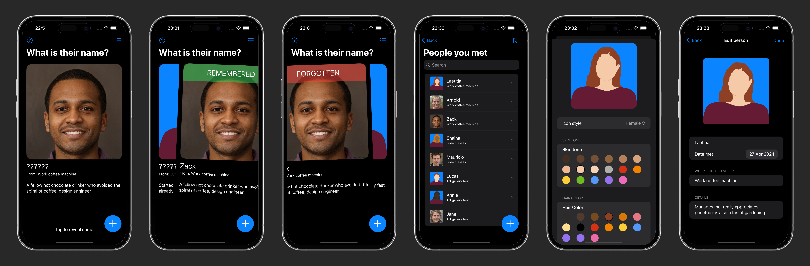

# Nameory 

## Description 
[Nameory](https://apps.apple.com/fr/app/nameory/id6499549520?l=en-GB) helps you remember names using the scientifically proven method of spaced repetition, ensuring quick recall and long-term retention. This app is perfect for anyone looking to make lasting connections, whether in personal, networking, or business contexts. 

## Features
- **Boost Your Memory:** Log new acquaintances' names and essential details effortlessly.
- **Make Lasting Impressions:** Enhance personal and professional relationships by remembering names, which is key to building trust. - **Tailored Learning:** Adaptive learning algorithm tailored to your memorization pace. 
- **Simple and Intuitive:** Easy-to-use interface, allowing you to focus more on interactions rather than managing the software.
- **Privacy First:** All data is stored locally on your device and not shared.
- **Rapid Name Capture:** Quick entry of names to minimize interaction disruption.
- **Custom Profiles:** Create detailed profiles for each contact including their photo, meeting context, and other personal details.
- **Smart Search Functionality:** Retrieve forgotten names through a powerful search tool that can filter by any recorded detail.
- **Spaced Repetition System (SRS):** Algorithm adjusts review times based on your performance to keep memory fresh. 

## Screenshots
 